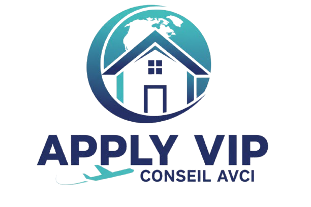

<p align="center">
  <a href="https://applyvipconseil.com" target="_blank">
    
  </a>
</p>

<h1 align="center">A.V.C Institute (Apply VIP Conseil)</h1>

<p align="center">
  <strong>Comprehensive France Immigration, Study & Real Estate Investment Services</strong>
</p>

<p align="center">
  <a href="#about-the-project">About</a> •
  <a href="#key-features">Features</a> •
  <a href="#technology-stack">Tech Stack</a> •
  <a href="#getting-started">Getting Started</a> •
  <a href="#localization">Localization</a> •
  <a href="#admin-dashboard">Admin Section</a>
</p>

---

## About The Project

**A.V.C Institute (Apply VIP Conseil)** is a premier consulting firm specializing in helping individuals navigate the complexities of moving to, studying in, and investing in France. From student visas (Campus France) to Talent Passports and real estate acquisition, A.V.C provides expert guidance for a seamless transition to life in France.

## Key Features

- **🎓 Higher Education Guidance**: Expert assistance for university admissions, Campus France procedures, and student visa applications.
- **🛂 Immigration Consulting**: Comprehensive support for residence permits (Titre de Séjour), Talent Passports, and legal appeals.
- **🏠 Accommodation Services**: Securing housing in France, handling lease guarantors, and assisting with CAF financial aid.
- **💼 Investment & Real Estate**: Guidance for real estate investment opportunities across France.
- **📰 Multilingual Blog**: Up-to-date news and guides on French immigration laws and administrative updates.
- **🛠️ Admin Dashboard**: Robust backend for managing blog posts, user questions, comments, and consultation requests.

## Technology Stack

The application is built using the latest web technologies:

- **Framework**: [Laravel 12.x](https://laravel.com)
- **Language**: PHP 8.4+
- **Frontend**: Blade Templates, Vanilla CSS, Vite
- **Database**: Relational Database (integrated via Eloquent ORM)
- **Packages**:
  - `intervention/image` for image processing
  - `stevebauman/location` for user geolocation
  - `mews/purifier` for content sanitization
  - `laravel/sanctum` for API authentication

## Getting Started

### Prerequisites

- PHP 8.4 or higher
- Composer
- Node.js & npm

### Installation

1. **Clone the repository**:
   ```bash
   git clone git@github.com:pouyasadri/avc-institute.git
   cd avc-institute
   ```

2. **Install dependencies**:
   ```bash
   composer install
   npm install
   ```

3. **Environment Setup**:
   ```bash
   cp .env.example .env
   php artisan key:generate
   ```

4. **Database & Storage**:
   ```bash
   php artisan migrate --seed
   php artisan storage:link
   ```

5. **Run the application**:
   ```bash
   npm run dev
   # In another terminal
   php artisan serve
   ```

## Localization

The platform supports multiple languages to serve a diverse international clientele:
- 🇬🇧 **English**
- 🇫🇷 **French**
- 🇮🇷 **Persian (Farsi)**

Routes are locale-prefixed (e.g., `/en`, `/fr`, `/fa`).

## Admin Dashboard

The administrative section is accessible at `/admin` (locale-independent) and provides tools for:
- Managing blog categories and articles.
- Reviewing and responding to user questions.
- Handling consultation bookings.
- Managing administrative users.

---

<p align="center">
  Developed by <strong>Apply VIP Conseil</strong>
</p>
